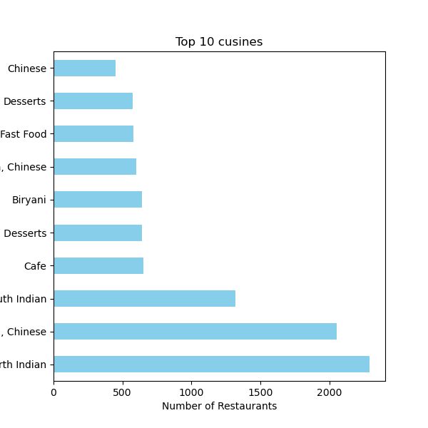

🍽️ Zomato Data Analysis 📊

This project performs an in-depth exploratory data analysis (EDA) on Zomato’s restaurant dataset. It uncovers insights about restaurant ratings, popular cuisines, average costs, and geographical trends. Various graphs and charts are generated to visualize and interpret the data effectively.

📂 Dataset: Zomato Dataset on Kaggle

# 🍽️ Zomato Data Analysis 📊  

This project performs an in-depth exploratory data analysis (EDA) on Zomato’s restaurant dataset. The goal is to uncover valuable business insights about popular cuisines, rating trends, and cost distributions, and visualize them using graphical plots.

---

## 📌 Dataset  

📂 **Source:** [Zomato Dataset on Kaggle](https://www.kaggle.com/datasets)  
*(Due to file size limits, it isn’t included here. Please download and place it in your project folder.)*

---

## 🛠️ Basic Working of the Project  

The project follows a structured workflow:

### ✅ 1️⃣ Data Loading & Cleaning  
- Loaded the dataset using `pandas`.
- Checked for null values and datatypes.
- Removed unnecessary columns and standardized categorical entries.

---

### ✅ 2️⃣ Data Exploration  
- Explored restaurant counts by cuisines.
- Identified unique values in columns like city, rating, cuisine, and average cost.

---

### ✅ 3️⃣ Visualizing Insights  

### 📊 **Top 10 Most Popular Cuisines**

A horizontal bar chart showing the top 10 most frequently listed cuisines.

---

### 📊 **Rating Distribution of Restaurants**

A histogram visualizing how restaurant ratings are distributed on the platform.

---

## 📦 Project Structure  

├── images/ # Output images of graphs
│ ├── bar_chart.png
│ └── histogram.png
├── zomato_data_analysis.ipynb # Main Jupyter Notebook with analysis code
├── requirements.txt # Python library dependencies
└── README.md # Project documentation (this file)

📝 Features
Perform data cleaning and preprocessing on restaurant data.

Explore location-based, rating-based, and cuisine-based trends.

Visualize insights using clean, intuitive charts.

Save all generated plots in the /images directory for documentation and presentation.

📚 Requirements
Python 3.x

pandas

numpy

matplotlib

seaborn

(Install using pip install -r requirements.txt)
